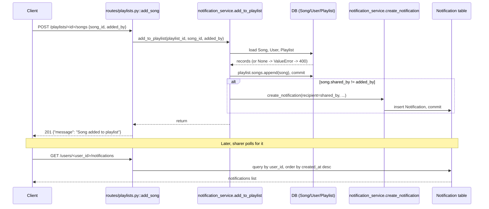
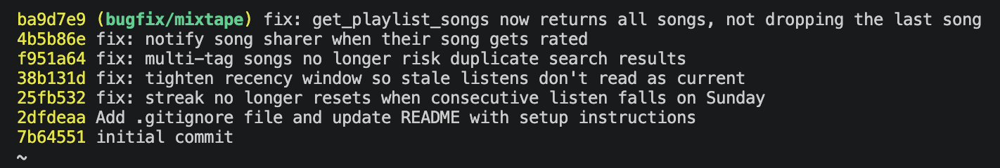

# Mixtape — Codebase Map

## AI Usage

I used Claude (Claude Code) throughout this project, mainly for orientation, execution, and as a check on my own reasoning — not to hand it the bugs cold and take its answer.

- **Codebase orientation:** gave it each `services/*.py` file and asked what it was responsible for, then asked it to trace the full add-song-to-playlist → notification data flow across `routes/playlists.py`, `notification_service.py`, and `models.py`. It also generated the mermaid sequence diagram for that flow once I'd confirmed the trace was right.
- **Repro scripts:** for each bug, I had it write a short isolated Python script (direct service-function calls in an app context, not HTTP) to trigger the reported symptom before touching any code.
- **Where it was wrong and I had to catch it:** for bug #3 (duplicate search), its first pass concluded the bug reproduced as reported, based only on reading the missing `.distinct()` — it hadn't actually run anything. When I ran the repro script myself, it returned 1 result, not 3, contradicting that. I pushed it to explain the mismatch, and it correctly traced it to SQLAlchemy legacy `Query.all()` silently deduping ORM entities — but I only trusted that once it also showed me raw SQL for the same join returning 3 rows. Without that second check I'd have just accepted a plausible, but unverified, explanation.
- **Where I had to correct its fix:** its first patch for bug #4 added the `create_notification` call after the `if existing / else` block instead of inside the `else` branch, which meant updating the score fired a duplicate notification — an unintended consequence it hadn't flagged itself.
- **Where I verified independently rather than trusting its claim:** for the bug #2 fix (shrinking `RECENT_THRESHOLD` from 24h to 1h), I asked whether that could break existing seed-data demo behavior. It hypothesized it might. I checked `seed_data.py` directly and found the seed comments already documented which events were meant to disappear after the fix — the 1h threshold matched that intent exactly, so the hypothesized risk didn't hold up.
- Test suite runs (`pytest tests/`) were used as ground truth throughout, not AI's say-so — several bugs (#1, #5) were already encoded as failing tests before I fixed anything, which is what let me confirm the AI's proposed root causes rather than just believing them.

## Main Files

**app.py** — Flask application factory (`create_app`). Configures SQLAlchemy (SQLite by default, `DATABASE_URL` env override), registers all four blueprints under prefixes (`/songs`, `/playlists`, `/users`, `/feed`), and calls `db.create_all()` on startup. No root (`/`) route exists — hitting `/` 404s by design.

**models.py** — Defines 7 SQLAlchemy models plus 3 association tables:
- `User` — has `listening_streak`/`last_listened_at` for streak tracking, and a self-referential many-to-many `friends` relationship (via the `friendships` table, which is directional in schema — `user_id`/`friend_id` — but treated as symmetric by the app).
- `Song` — `shared_by` (FK to User) tracks who originally shared it; has a `share_note`. Tagged via `song_tags` (many-to-many with `Tag`).
- `Tag` — just an id/name lookup table.
- `ListeningEvent` — one row per (user, song, timestamp) play — this is the event log the feed and streak features read from.
- `Rating` — one row per (user, song) pair, enforced by a `UniqueConstraint`; score 1–5.
- `Playlist` — has `is_collaborative` flag; songs linked via `playlist_entries`, which (unlike `song_tags`) carries extra columns: `position` (explicit ordering, not insertion order), `added_by`, `added_at`.
- `Notification` — `user_id` (recipient), `notification_type`, `body`, `read` flag.

**routes/** — one blueprint per resource (`songs.py`, `playlists.py`, `users.py`, `feed.py`). Every route function is thin: parse request args/JSON → call a service function → catch `ValueError` → shape the JSON response with the right status code (400/404/201). No business logic lives here.

**services/** — where all business logic lives:
- `search_service.py` — `search_songs` (title/artist `ILIKE` match) and `get_song`.
- `playlist_service.py` — CRUD-ish: `create_playlist`, `get_playlist`, `get_playlist_songs`, `get_user_playlists`.
- `notification_service.py` — `create_notification` (generic writer), `add_to_playlist` (adds song + triggers notification), `rate_song`, `get_notifications`, `mark_as_read`. This module owns both the playlist-add side effect *and* rating — a bit of a grab-bag rather than one responsibility.
- `streak_service.py` — `record_listening_event` (writes a `ListeningEvent`, then updates the streak) and the streak math itself in `update_listening_streak`.
- `feed_service.py` — `get_friends_listening_now` (last 24h, deduped to one song per friend) and `get_activity_feed` (last N events, no recency filter, no dedup).

## Data Flow — adding a song to a playlist

1. Client: `POST /playlists/<playlist_id>/songs` with `{song_id, added_by}` → `routes/playlists.py::add_song`.
2. Route validates the two required fields are present, then calls `notification_service.add_to_playlist(playlist_id, song_id, added_by)`.
3. Inside `add_to_playlist`:
   - Loads `Song`, `User` (the adder), and `Playlist` — raises `ValueError` (→ 400 at the route) if any is missing.
   - If the song isn't already in `playlist.songs`, appends it and commits. (Note: this goes through the ORM `songs` relationship on `Playlist`, not a manual insert into `playlist_entries` — so `position`/`added_by`/`added_at` on that association row are whatever SQLAlchemy defaults apply, not explicitly set here despite the service accepting `added_by_user_id`.)
   - If `song.shared_by != added_by_user_id` (i.e., someone other than the original sharer added it), calls `create_notification(user_id=song.shared_by, ...)` with a body like `"{adder} added your song '{title}' to the playlist '{name}'."`
4. `create_notification` just builds and commits a `Notification` row.
5. Route returns `{"message": "Song added to playlist"}, 201`.
6. Later, the sharer fetches `GET /users/<user_id>/notifications` → `routes/users.py::notifications` → `notification_service.get_notifications`, which queries `Notification` filtered by `user_id` (and optionally `read=False`), ordered newest-first.

So the notification is a side effect fired synchronously inside the same request that adds the song — there's no queue/event bus, just a direct function call from one service into another.

## Mermaid Diagram

## Patterns Noticed

- **Separation of routing and business logic.** Every route: parse → call one service function → `except ValueError` → jsonify. Business rules (streak math, notification triggers, dedup logic) all live in `services/`, never in `routes/`.
- **`ValueError` is the app's control-flow signal for "not found" / "bad input."** Services raise it for missing users/songs/playlists; routes catch it and map to 404 or 400 depending on context. No custom exception hierarchy.
- **Service-to-service calls happen directly**, not through routes — e.g. `notification_service.add_to_playlist` imports and calls into `playlist_service` indirectly by mutating `playlist.songs` (ORM relationship) rather than calling a `playlist_service` function; `streak_service.record_listening_event` calls its own `update_listening_streak` helper in the same module. Cross-service dependencies exist (e.g. `notification_service.add_to_playlist` does a local `from services.playlist_service import get_playlist_songs` that's actually unused in the function body).
- **`to_dict()` lives on the model, not the service.** Every model has its own serialization method; services just call `.to_dict()` on whatever they fetch before (or the route does).
- **Association tables carry metadata inconsistently.** `song_tags` and `friendships` are pure link tables (just the two FKs). `playlist_entries` is richer — `position`, `added_by`, `added_at` — because playlist order/attribution matters in a way tags and friendships don't.
- **IDs are UUID strings everywhere** (`generate_uuid()` default), not auto-increment ints — consistent across all 7 models.

## Commit History

Five fix commits on `bugfix/mixtape`, one per bug, merged into `main`:

## Bug Root-Cause Analysis

### Bug 1 — streak keeps resetting (`streak_service.py`)

**How reproduced:** called `update_listening_streak(user, now)` directly with two fixed UTC datetimes one calendar day apart — Sat 2024-06-15 then Sun 2024-06-16. Expected streak to go 1 → 2. Got 1 → 1.

**How I found the root cause:** started at `streak_service.py` since the symptom names the streak feature directly. `record_listening_event` just stamps `now()` and delegates to `update_listening_streak`, so that's the real target. Read it top to bottom: it buckets into "same day / 1-day gap / bigger gap." The 1-day-gap branch read `elif days_since_last == 1 and today.weekday() != 6:` — the `and today.weekday() != 6` doesn't appear anywhere in the function's own docstring ("If the user listened yesterday: streak increments by 1" — no weekday exception mentioned). That mismatch between the stated rule and the actual condition was the confirming moment. Cross-checked against `tests/test_streaks.py::test_streak_increments_on_sunday`, which encodes exactly this Sat→Sun case and was failing before any fix — same root cause, independently confirmed.

**The root cause:** `days_since_last == 1` correctly detects a consecutive-day listen, but the extra `and today.weekday() != 6` clause suppresses the increment specifically when the new listen happens on a Sunday (`datetime.weekday()` returns `6` for Sunday). So a user who listens Saturday then Sunday falls into the 1-day-gap branch, fails the `!= 6` check, and drops through to the `else`, which resets the streak to 1 instead of incrementing it to 2.

**Fix and side-effect check:** removed `and today.weekday() != 6`, leaving `elif days_since_last == 1:` to increment unconditionally. Reran `tests/test_streaks.py` in full (not just the Sunday case) to confirm the same-day dedup (`test_streak_does_not_double_count_same_day`) and skipped-day reset (`test_streak_resets_after_skipped_day`) still pass — those paths don't touch the removed condition, and both still behave correctly, so the fix only changed the Sunday case.

### Bug 2 — feed shows stale "listening now" (`feed_service.py`)

**How reproduced:** inserted a `ListeningEvent` for a friend timestamped 23h50m in the past, then called `get_friends_listening_now(user_id)`. That friend appeared in the result, labeled as currently listening.

**How I found the root cause:** went to `feed_service.py`, the file that owns "Friends Listening Now." `get_friends_listening_now` builds `cutoff = datetime.now(timezone.utc) - RECENT_THRESHOLD` and filters events `>= cutoff`. Compared it against `get_activity_feed` in the same file, which has no recency filter at all — the only thing that makes the first function mean "now" instead of "ever" is that one constant. Checked its value: `RECENT_THRESHOLD = timedelta(hours=24)`. That's the moment of confidence — there's no separate "is this actually live" check, "now" is defined purely as "within the last 24 hours."

**The root cause:** the function's only recency filter is a flat 24-hour window. Nothing distinguishes a listen from 2 minutes ago from one 23 hours ago — both pass the same `>= cutoff` check and get reported identically as "listening now," so a friend's listen from yesterday shows up as if it were happening live.

**Fix and side-effect check:** narrowed `RECENT_THRESHOLD` from 24 hours to 1 hour. Checked `get_activity_feed`, the other consumer of `friend_ids`/events in this file — it doesn't reference `RECENT_THRESHOLD` at all, so it's unaffected by the change. No other module imports this constant.

### Bug 3 — duplicate search results (`search_service.py`)

**How reproduced:** called `search_songs("Frequencies")` against a seeded song with 3 tags, expecting 3 duplicate entries per the report. Got 1 result — contradicted the reported symptom, so I didn't stop there (see below).

**How I found the root cause:** `routes/songs.py::search` calls straight into `search_service.search_songs`, so that's the only function in the path. Read the query: `db.session.query(Song).outerjoin(song_tags, Song.id == song_tags.c.song_id).filter(...).all()`, no `.distinct()`. A join from `Song` to `song_tags` (a song↔tag link table) produces one SQL row per matching tag row, so a 3-tag song should join to 3 rows. But the direct repro returned only 1. To resolve the contradiction, I ran the identical join as raw SQL (`select s.id from song s join song_tags st on s.id = st.song_id where s.title = 'Frequencies'`) and got back 3 rows — confirming the join itself does fan out per tag, exactly as suspected from reading the code. The gap between "3 rows at the SQL level" and "1 result from `search_songs`" was the real finding: SQLAlchemy's legacy `Query.all()` API auto-deduplicates full ORM entity results by primary key identity, even with no `.distinct()` in the query. That implicit behavior — not any dedup logic in `search_songs` — is what's suppressing the symptom.

**The root cause:** the query is written incorrectly (joins a one-to-many link table without deduplicating), and would return literal duplicate `Song` entries. It doesn't currently manifest because the app happens to call this query through `Query.all()`, whose ORM-entity dedup silently absorbs the duplication. So the described symptom ("same song shows up twice") isn't reproducible as stated on this SQLAlchemy version (2.0.51) and code path, but the underlying defect is real and would surface immediately if this query were ever run via SQLAlchemy 2.0-style `select()` execution, which doesn't auto-dedupe entities.

**Fix and side-effect check:** added `.distinct()` to the query — a no-op today given the existing implicit dedup, but it makes correctness explicit instead of relying on undocumented `Query` behavior. Reran `tests/test_search.py` in full: `test_search_no_duplicates_no_tag_song` and `test_search_no_duplicates_single_tag_song` still pass, confirming `.distinct()` doesn't drop legitimate single results for songs with 0 or 1 tags.

### Bug 4 — no notification on rating (`notification_service.py`)

**How reproduced:** called `rate_song(other_user_id, song_id, 5)` on a song shared by a different user, then compared `get_notifications(sharer_id)` before and after. Notification count didn't change.

**How I found the root cause:** both the working case (playlist-add notifies) and the broken case (rating doesn't) live in the same file, `notification_service.py`, so I read `add_to_playlist` and `rate_song` side by side. `add_to_playlist` ends with an explicit block: `if song.shared_by != added_by_user_id: create_notification(...)`. `rate_song` ends with `db.session.commit(); return rating` — no equivalent block, no call to `create_notification` anywhere in the function. That structural gap between two functions in the same module, meant to follow the same "notify the sharer" pattern, was the confirming moment — not just "notifications seem broken," but the literal missing function call.

**The root cause:** `rate_song` persists the `Rating` row but never invokes `create_notification`. There's no logic bug in the comparison or a wrong condition — the notify step for this action was never written, unlike the equivalent step in `add_to_playlist`.

**Fix and side-effect check:** added a `create_notification` call inside the `else` (new-rating) branch of `rate_song`, gated on `song.shared_by != user_id` (mirroring the self-action guard already used in `add_to_playlist`, so a user rating their own shared song doesn't get notified about it). Call lives inside the `else` branch, so only a brand-new rating notifies, not an update to an existing one.

### Bug 5 — last playlist song missing (`playlist_service.py`)

**How reproduced:** used the seeded 5-song `seed_playlist` fixture from `tests/test_playlists.py`, called `get_playlist_songs(playlist_id)`, and got 4 songs back — "Track 5," the last one added, was missing.

**How I found the root cause:** `routes/playlists.py::get_songs` calls straight into `playlist_service.get_playlist_songs`. Read the function: it queries `Song` joined to `playlist_entries`, ordered by `position` ascending — that part matches the docstring's "songs in playlist order." But the final line was `return [song.to_dict() for song in songs[:-1]]`. That's inconsistent with the function's own inline comment directly above the query ("Note: This function returns all songs in the playlist") — the code contradicts its own documented behavior. That contradiction, not just "playlist looks short," was the confirming moment.

**The root cause:** the ordered `songs` list is correct and complete after the query runs, but the return statement slices it with `[:-1]`, which drops the last element of any list regardless of its length or contents. Every non-empty playlist loses its most-recently-positioned song purely because of this slice — it has nothing to do with ordering, tags, or specific songs.

**Fix and side-effect check:** changed `songs[:-1]` to `songs`. Reran `tests/test_playlists.py` in full: `test_playlist_returns_songs_in_order` now passes with all 5 titles in the correct sequence, confirming the ordering logic itself (the `join`/`order_by` on `position`) was never the problem — only the trailing slice was. `get_playlist` (metadata-only, no song list) is a separate function and doesn't call `get_playlist_songs`, so it's unaffected.

